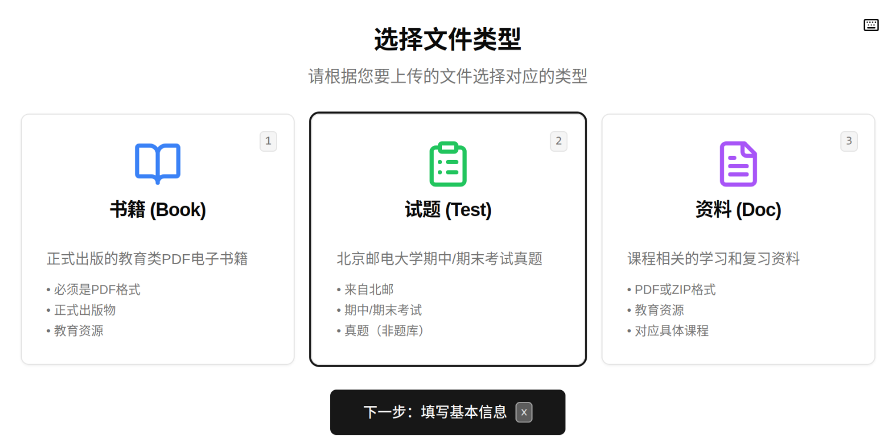
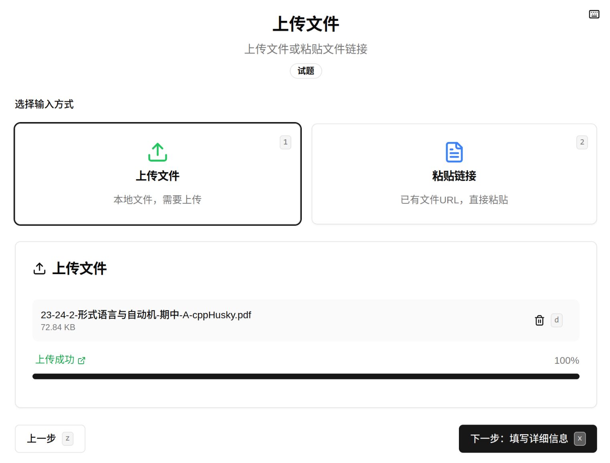
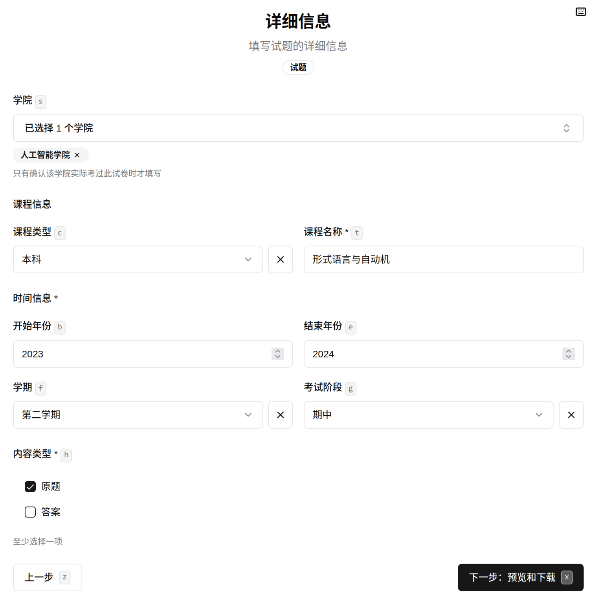
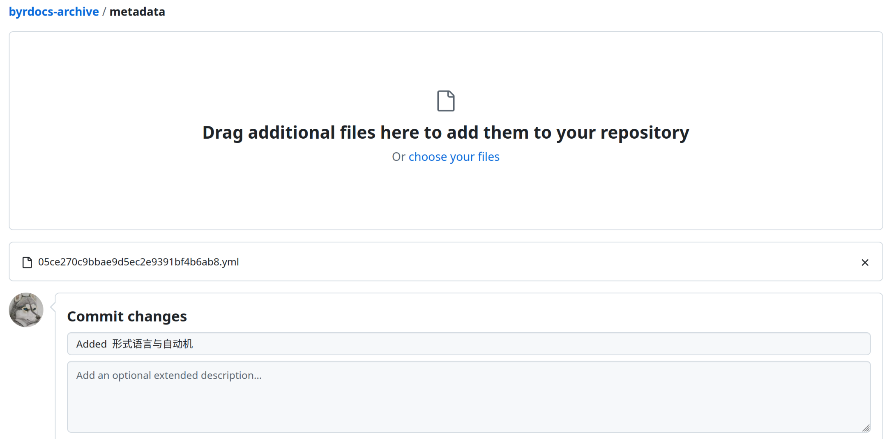
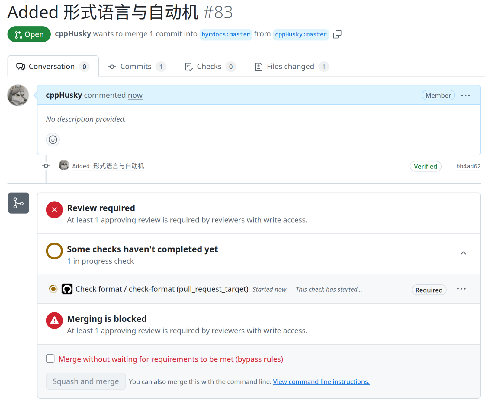
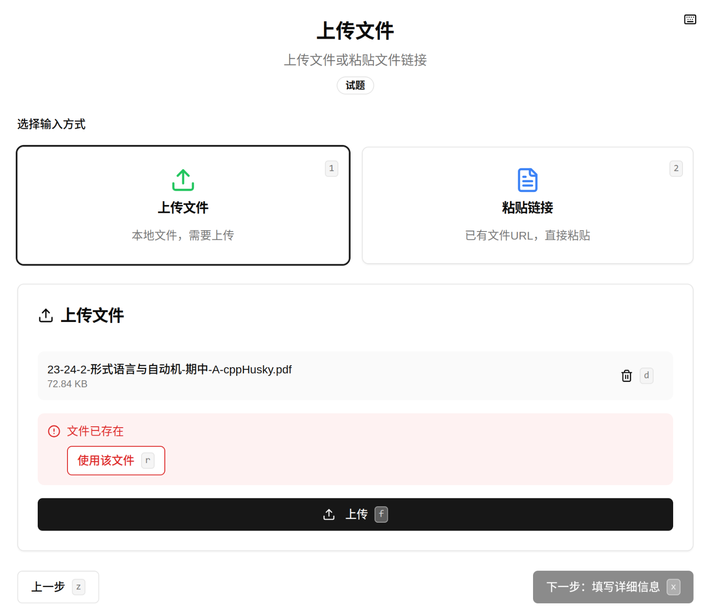
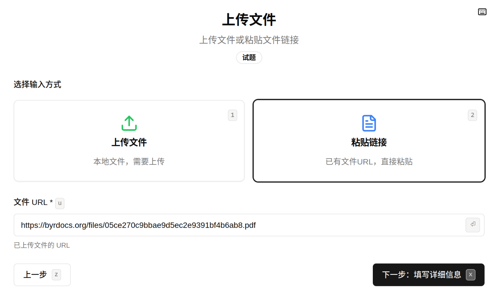

# 贡献指南

欢迎你向本项目贡献文件！本文档将会介绍如何向 BYR Docs 添加文件。

## 前提

首先，你需要确保你计划上传的文件符合本站的 [文件收录规则](docs/文件规则.md#文件收录规则)。

## 添加新文件之步骤

首先你需要完成必要的配置。

1. [fork 本仓库](https://github.com/byrdocs/byrdocs-archive/fork)。

当确认配置工作完成后，你可以正常添加文件。

1. 打开 [BYR Docs Publish](https://publish.github.com/)
2. 选择文件类型，比如「试题 (Test)」。
3. 选择本地文件并上传。
4. 填写有关试卷的详细信息。
5. 下载 yml 文件，并将其存入**你 fork 的仓库中的 metadata 目录下**。你可以在本地使用 git 进行管理，或者在 GitHub 网站中直接上传。
6. 向原仓库创建一个 pull request。等待维护者审核、合并。

如果在 pull request 审核期间需要做新的更改，可以继续提交至你 fork 的仓库中，正在进行的 pull request 也会得到更新。

### 文件已存在

如果在上传文件时遇到「文件已存在」的问题：

说明该文件已存在于服务器中，已经由你或其它人上传。你可以直接使用该文件的 URL，如下图所示：

## 如需其它修改

- **修改文件元信息**：直接修改对应的 yml 文件；
- **删除文件**：直接删除对应的 yml 文件即可。
- **修改文件内容**：修改文件内容会导致 md5sum 发生变化，因此必须删除原来的 yml 文件，并[添加新文件](#添加新文件之步骤)。
