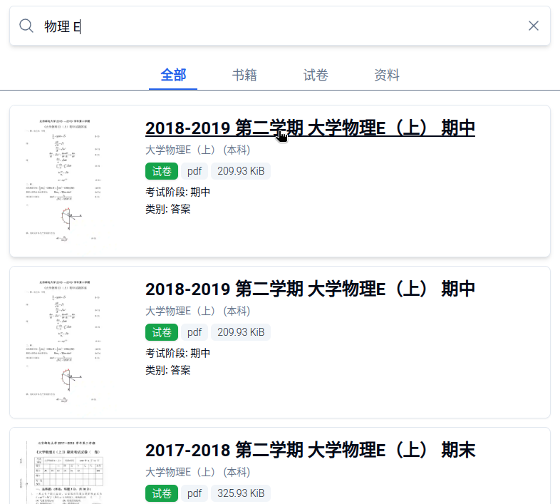

# BYR Docs Archive

**BYR Docs** 系北京邮电大学（下称“北邮”）校内资料分享平台，旨在使校内学生更方便地获取与北邮课程有关的教育资源，包括电子书籍、考试题目和复习资料等。

## 注意事项

> [!WARNING]
> **本项目仅面向北邮在校学生提供服务。** 如果您不是北邮在校学生，我们保留中止向您提供服务的权利。

> [!TIP]
> 欢迎加入QQ群 `829649976` 交流 BYR Docs 有关事项，包括向本项目贡献资料。

> [!NOTE]
> **请勿在 Issues 内请求资源。** 我们目前无暇处理大量的资源请求。

## 如何使用

您可以访问 [BYR Docs](https://byrdocs.org) 网站，搜索并获取您想要的资源。

您可使用关键词，诸如书名、作者、出版社、ISBN、科目、年份来查找您想要的文件。

如果您找到了目标文件，点击文件的标题就可以开始下载了。

## 如何贡献

- 贡献文件，请参阅[贡献指南](./CONTRIBUTING.md)
- 我们不接受任何形式的捐赠，除非是向我们提供资料。当然，您需要确保您对自己提供的资料有合法的分发权限。
- 如果您有意参与维护本项目，可发送邮件到 [contact@byrdocs.org](mailto:contact@byrdocs.org) 与我们联系。
